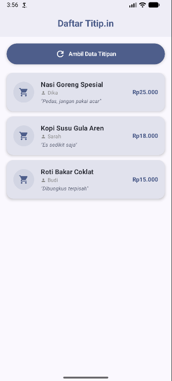
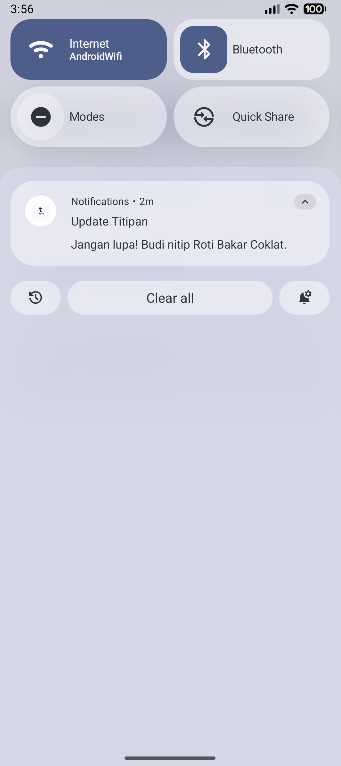

# 🔔 Notifications (Titip.in Demo)

Aplikasi demo Android sederhana yang dibuat menggunakan **Kotlin** dan **Jetpack Compose**. Proyek ini secara khusus berfokus pada implementasi fitur **Notifikasi** dan penanganan izin notifikasi untuk perangkat modern (Android 13/API 33+).

-----

## 🚀 Fitur Utama

  * **Pemuatan Data Lokal:** Aplikasi memuat daftar tugas/titipan dari file JSON statis (`titipin-data.json`) yang disimpan di folder `assets`.
  * **Tampilan Daftar:** Menampilkan data barang titipan (nama barang, pemesan, harga, dan catatan) dalam `LazyColumn` di `TitipanScreen`.
  * **Pemicu Notifikasi:** Notifikasi akan dipicu secara otomatis segera setelah proses pemuatan data selesai.
  * **Notifikasi Adaptif (API 33+):** Aplikasi meminta izin `android.permission.POST_NOTIFICATIONS` secara dinamis saat dijalankan di Android 13 (TIRAMISU) atau versi yang lebih baru.
  * **Pesan Notifikasi Acak:** Pesan notifikasi yang ditampilkan dipilih secara acak dari salah satu item data yang berhasil dimuat.

-----

## 📸 Tangkapan Layar

| Layar Utama | Layar Notifikasi |
| :---: | :---: |
|  |  |

-----

## 💾 Mekanisme Notifikasi & Data

Proyek ini menggunakan kombinasi Coroutines, Flow, dan Notification Manager bawaan Android.

### 1\. Pemuatan Data Asinkronus

  * **Repository:** `TitipanRepository` bertanggung jawab untuk meniru operasi I/O yang memakan waktu (menggunakan `Thread.sleep(2000)`) dan memuat data JSON menjadi daftar objek `Titipan` menggunakan **Google Gson**.
  * **ViewModel:** `TitipanViewModel` menggunakan `viewModelScope.launch` untuk memanggil `getTitipanData()` dari Repository secara aman di *background thread*.

### 2\. Pemicuan Notifikasi

  * **Flag Reaktif:** ViewModel memiliki `_processFinished: MutableStateFlow<Boolean>`. Setelah data selesai dimuat, nilai `_processFinished` diubah menjadi `true`.
  * **Effect di UI:** Di `TitipanScreen.kt`, `LaunchedEffect` mengamati `processFinished`. Ketika nilainya menjadi `true`, ia menjalankan logika pengecekan izin notifikasi dan memanggil fungsi `showNotification`.
  * **Helper Notifikasi:** Fungsi `showNotification(context, message)` membuat `NotificationChannel` (`titipan_channel`) dan membangun notifikasi menggunakan `NotificationCompat.Builder`.

-----

## 🛠️ Tumpukan Teknologi

  * **Bahasa:** Kotlin
  * **UI:** Jetpack Compose (Material 3)
  * **Asinkronus:** Kotlin Coroutines & Flow
  * **Data Parsing:** Google Gson (`com.google.code.gson`)

-----

## 📐 Arsitektur Kode (MVVM)

Aplikasi ini menggunakan pola desain **Model-View-ViewModel (MVVM)**:

  * **View (UI):** `TitipanScreen.kt`
      * Bertanggung jawab untuk menampilkan UI dan menerima *user input* (klik tombol).
      * Mengonsumsi `StateFlow` dari ViewModel (misalnya `titipanList`, `isLoading`).
  * **ViewModel:** `TitipanViewModel.kt`
      * Menyimpan *state* UI (menggunakan `StateFlow`).
      * Mengandung logika untuk memuat data (`loadData()`) dan menentukan pesan notifikasi.
      * Berinteraksi dengan Repository.
  * **Model (Repository & Data):** `TitipanRepository.kt` dan `DataTitip.kt`
      * `TitipanRepository`: Menyediakan abstraksi untuk sumber data (dalam kasus ini, `assets/titipin-data.json`).
      * `Titipan`: Model data yang merepresentasikan setiap item titipan.

-----

## 🏃 Cara Menjalankan

1.  **Buka Proyek:** Impor proyek ke Android Studio.
2.  **Sinkronisasi Gradle:** Tunggu hingga Gradle selesai mengunduh dependensi (termasuk Gson).
3.  **Jalankan:** Jalankan aplikasi pada emulator atau perangkat.
4.  **Uji Notifikasi:** Klik tombol **"Ambil Data Titipan"**.
      * Jika dijalankan di Android 13+, aplikasi akan meminta izin notifikasi terlebih dahulu.
      * Setelah pemuatan data (dengan simulasi jeda 2 detik) selesai, sebuah notifikasi akan muncul di *status bar*.
